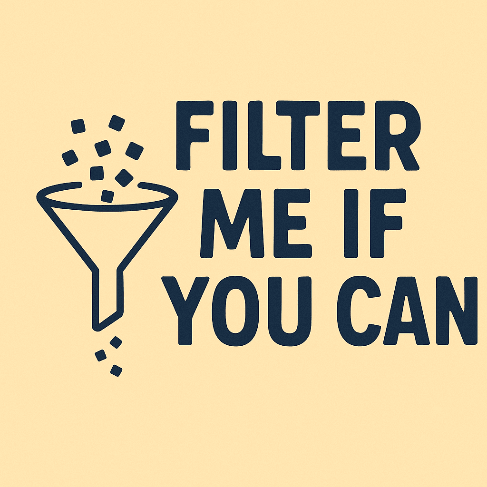

# Filter Me If You Can



### A mini Python project to practice:

- Organizing code with classes
- Reading CSV files
- Converting data into pandas DataFrames
- Applying filters on columns
- Saving processed outputs

The idea is to simulate a mini data pipeline: raw files are placed in ``data/raw``, processed with the code in ``src/core``, and final results are saved in ``data/processed``.


## How to run
How to Run

1. Clone the repository:
````
git clone https://github.com/your-username/filter-me-if-you-can.git

cd filter-me-if-you-can
````


2. Install dependencies with Poetry:

````
poetry install
````


3. Place your CSV files in the data/raw/ folder.

4. Run the project:

````
poetry run python src/main.py
````


The program will read the CSV files from data/raw, apply the filters defined in main.py, and save the consolidated results in data/processed/output.csv.

## Project Structure

````
filter-me-if-you-can/
│── src/
│   ├── core/  
│   │    ├── DataLoader.py   # Reads CSV files from the raw folder  
│   │    └── DataFilter.py   # Applies filters on DataFrames  
│   └── main.py              # Main script to run the pipeline  
│── data/  
│   ├── raw/                 # Place your input CSV files here  
│   │    └── students_score.csv  
│   └── processed/           # Processed output files  
│── assets/                  # Logo/images  
│── pyproject.toml           # Poetry configuration  
└── README.md

````

## Filter Configuration

In ``src/main.py``, you can customize:

``column_to_filter`` → the column used for filtering (e.g., "city")

``variable_filtered`` → the value to keep in the DataFrame (e.g., "Curitiba")

## Example
**Input (data/raw/students_score.csv):**
````
name	age	city
Maria	23	Curitiba
João	31	São Paulo
Rebeca	27	Curitiba`
````
**Output (data/processed/output.csv):**
````
name	age	city
Maria	23	Curitiba
Rebeca	27	Curitiba
````
----
**_This project is a quick and fun way to practice object-oriented Python and basic data engineering concepts._**
